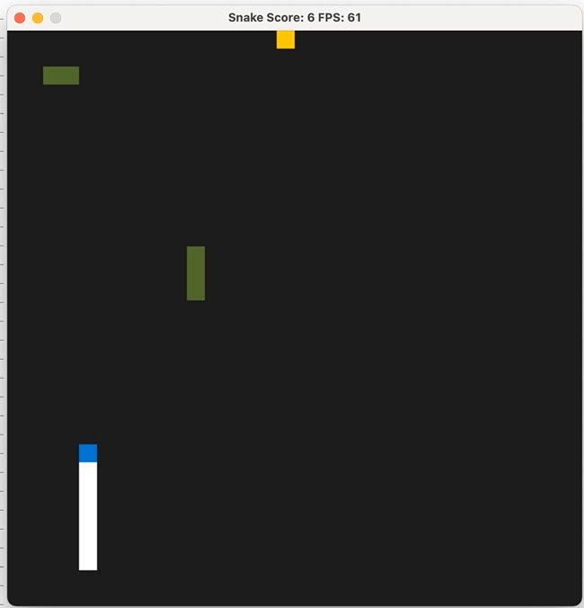

# CPPND: Capstone Snake Game

This is my implementation of the Capstone Project provided [Udacity C++ Nanodegree Program](https://www.udacity.com/course/c-plus-plus-nanodegree--nd213). The code for this repo was inspired by [this](https://codereview.stackexchange.com/questions/212296/snake-game-in-c-with-sdl) excellent StackOverflow post and set of responses.

The main implementation effort, went into adding obstacles to the classic Snake Game.

## Addressed Rubric Points
The project satisfies the following (non ***REQUIRED***) Rubric Points
### Loops, Functions, I/O
| **Criteria** | **Comment**  |
|---|---|
|  The project demonstrates an understanding  of C++ functions and control structures. |  The addede functions to deal with obstacles, use appropriate functions   and control structures.  |   
|  The project reads data from a file and process  the data, or the program writes data to a file. |  The obstacles are read from a .txt file. |   
|  The project accepts user input and processes   the input. |  Ther user can choose the playing mode and load the obstacle map. |   
### Object Oriented Programming
| **Criteria** | **Comment**  |
|---|---|
|  The project uses Object Oriented Programming   techniques. |  The obstacles are handled within an appropriate Class. |  
|  Classes use appropriate access specifiers for   class members. |  All class data members are explicitly specified as public, protected, or private. |  
|  Class constructors utilize member initialization lists. |  Appropriate initialization. |  
|  Classes abstract implementation details from their   interfaces. |  Informative function names and appropriate comments are used. |  
|  Classes encapsulate behavior. |  Getters are used in obstacles class. |  

  
## Dependencies for Running Locally
* cmake >= 3.7
  * All OSes: [click here for installation instructions](https://cmake.org/install/)
* make >= 4.1 (Linux, Mac), 3.81 (Windows)
  * Linux: make is installed by default on most Linux distros
  * Mac: [install Xcode command line tools to get make](https://developer.apple.com/xcode/features/)
  * Windows: [Click here for installation instructions](http://gnuwin32.sourceforge.net/packages/make.htm)
* SDL2 >= 2.0
  * All installation instructions can be found [here](https://wiki.libsdl.org/Installation)
  >Note that for Linux, an `apt` or `apt-get` installation is preferred to building from source. 
* gcc/g++ >= 5.4
  * Linux: gcc / g++ is installed by default on most Linux distros
  * Mac: same deal as make - [install Xcode command line tools](https://developer.apple.com/xcode/features/)
  * Windows: recommend using [MinGW](http://www.mingw.org/)

## Basic Build Instructions

1. Clone this repo.
2. Make a build directory in the top level directory: `mkdir build && cd build`
3. Compile: `cmake .. && make`
4. Run it: `./SnakeGame`.

## How To Play

1. Start the executable `./SnakeGame`
2. Choose the game mode (Easy/Advanced) by interacting with the Terminal
3. If you choose advanced, you will be asked for an obstacle file. Such a file is provided in the [resources](/resources/obstacles.txt) folder.   You have to specify the entire file path, so assuming you downloaded the file to your home folder, it should look something like this: `user/home/CppND-Capstone-Snake-Game/resources/obstacles.txt` 
4. Enjoy and try to avoid the obstacles!

## CC Attribution-ShareAlike 4.0 International

Shield: [![CC BY-SA 4.0][cc-by-sa-shield]][cc-by-sa]

This work is licensed under a
[Creative Commons Attribution-ShareAlike 4.0 International License][cc-by-sa].

[![CC BY-SA 4.0][cc-by-sa-image]][cc-by-sa]

[cc-by-sa]: http://creativecommons.org/licenses/by-sa/4.0/
[cc-by-sa-image]: https://licensebuttons.net/l/by-sa/4.0/88x31.png
[cc-by-sa-shield]: https://img.shields.io/badge/License-CC%20BY--SA%204.0-lightgrey.svg
